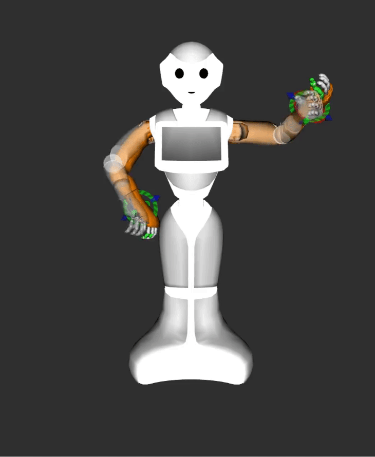

# Pepper_robot_ign_moveit2

Software packages for the humanoid robot pepper that enable manipulation with MoveIt 2 inside Gazebo. 
<p align="left" float="middle">
  
  
  
</p>


## Overview

This branch targets ROS 2 `galactic` and Gazebo `fortress`.

Below is an overview of the included packages, with a short description of their purpose. For more information, please see README.md of each individual package.

- [**pepper_robot**](./pepper_robot) – Metapackage
- [**pepper_robot_description**](./pepper_robot_description) – URDF and SDF description of the robot
- [**pepper_robot_ign**](./pepper_robot_ign) – Additional Gazebo-specific configuration of the robot
- [**pepper_robot_moveit_config**](./pepper_robot_moveit_config) – MoveIt 2 configuration for the robotic manipulator

## Instructions

### Dependencies

These are the primary dependencies required to use this project.

- ROS 2 [Galactic](https://docs.ros.org/en/galactic/Installation.html)
- Gazebo [Fortress](https://gazebosim.org/docs/fortress)

All additional dependencies are either pulled via [vcstool](https://wiki.ros.org/vcstool) ([pepper_robot.repos](./pepper_robot.repos)) or installed via [rosdep](https://wiki.ros.org/rosdep) during the building process below.

### Building

Clone this repository, import dependencies, install dependencies and build with [colcon](https://colcon.readthedocs.io).

```bash
# Clone this repository into your favourite ROS 2 workspace
git clone https://github.com/HibaSekkat/pepper_ign_moveit2.git
# Import dependencies
vcs import <     pepper_ign_moveit2/pepper_robot.repos
# Install dependencies
IGNITION_VERSION=fortress rosdep install -y -r -i --rosdistro ${ROS_DISTRO} --from-paths .
# Build
colcon build --merge-install --symlink-install --cmake-args "-DCMAKE_BUILD_TYPE=Release"
```

### Sourcing

Before utilising this package, remember to source the ROS 2 workspace.

```bash
source install/local_setup.bash
```

This enables:

- Execution of binaries, scripts and examples via `ros2 run pepper_robot_* <executable>`
- Launching of setup scripts via `ros2 launch pepper_robot_* <launch_script>`
- Discoverability of shared resources

To assess its functionality, start by constructing the Docker image (please be aware that having an NVIDIA GPU may be necessary for this configuration). Execute the following commands:

".docker/build.bash"

Subsequently, initiate the application using the following command:

".docker/run.bash 'ros2 launch pepper_robot gz.launch.py'"
